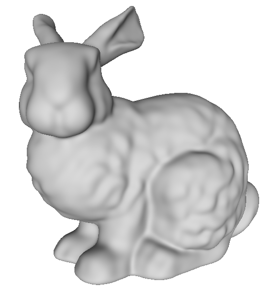

# [Neural Implicit Surface Evolution](https://dsilvavinicius.github.io/nise/)
[Tiago Novello [1]](https://sites.google.com/site/tiagonovellodebrito),
[Vinícius da Silva [2]](https://dsilvavinicius.github.io/),
[Guilherme Schardong [3]](https://schardong.github.io/),
[Luiz Schirmer [4]](https://www.lschirmer.com),
[Hélio Lopes [2]](http://www-di.inf.puc-rio.br/~lopes/),
[Luiz Velho [1]](https://lvelho.impa.br/)
<br>
[1] Institute for Pure and Applied Mathematics (IMPA),
<br>
[2] Pontifical Catholic University of Rio de Janeiro (PUC-Rio),
<br>
[3] University of Coimbra (UC)
<br>
[4] University of the Sinos Valley (UNISINOS)

This is the official implementation of "Neural Implicit Surface Evolution", published on the [Proceedings of ICCV 2023](https://openaccess.thecvf.com/content/ICCV2023/html/Novello_Neural_Implicit_Surface_Evolution_ICCV_2023_paper.html), also published on [arXiv](https://arxiv.org/abs/2201.09636). More results and examples on the [project page](https://dsilvavinicius.github.io/nise)


## Getting started

### Prerequisites

1. [Mamba (Miniforge)](https://github.com/conda-forge/miniforge) on Windows, alternativelly you can use [PyEnv](https://github.com/pyenv/pyenv) and [PyEnv-VirtualEnv](https://github.com/pyenv/pyenv-virtualenv) on UNIX based/like systems
2. [Git](https://git-scm.com/download)
4. (Optional) [MeshLab](https://www.meshlab.net/)
5. (Optional) [NVIDIA Kaolin](https://github.com/NVIDIAGameWorks/kaolin/)

If using Linux, or macOS, these programs should be available through the package manager, or Homebrew.

### Code organization
The common code is contained in the `nise` package. Inside the respective folder, there are the following files:
* `dataset.py` - contains the sampling and data classes
* `diff_operators.py` - implementation of differential operators (gradient, hessian, jacobian, curvatures)
* `loss.py` - contains loss functions for different experimental settings
* `meshing.py` - mesh creation through marching cubes
* `model.py` - networks and layers implementations
* `util.py` - miscelaneous functions and utilities

The main training and reconstruction scripts are in the repository's root folder:
* `meancurvature-train.py` - train a smoothing/sharpening of a single neural implicit surface (see Sec 6.2 in the paper)
* `morph-train.py` - train an interpolation between two neural implicit surfaces (see Sec 6.3 in the paper)
* `reconstruct.py` - given a trained model (pth) reconstructs the mesh using marching cubes at values `t` given by the user
* `vectorfield-train.py` - train a neural-based deformation of a neural implicit surface (see Sec 6.1 in the paper)

Additionally, under the `experiment_scripts` folder, there are more scripts with experiments and other auxiliary code that is generally independent of the main code.

**Note that these scripts were written them some time ago and may not run as smoothly as expected. We are working to update them.**
* `discrete_smoothing.py` - experiments with discrete smoothing methods (laplacian, cotangent, etc.)
* `enlarge_networks.py` - studying the effects of increasing network width in the training results (see Sec. 4.4 of the supplementary material)
* `lipschitz_exp.py` - experiments with lipschitz regularization
* `mean_curvature_scale.py` - experiments with different values for the mean curvature equation scale parameter (see Sec. 4.2 of the supplementary material)
* `point_sample_proportions.py` - experiments with the proportions of points drawn from the surface, off-surface and along time (see Sec. 4.3 of the supplementary material)
* `training_time_intervals.py` - studies with varying time-intervals for training (see Sec. 4.1 of the supplementary material)

### Setup and sample run

1. Open a terminal (or Git Bash if using Windows)
2. Clone this repository: `git clone git@github.com:dsilvavinicius/nise.git`
3. Enter project folder: `cd nise`
4. Setup project dependencies via Mamba
```
mamba env create -f environment.yml
conda activate nise
pip install -e .
```
or, if using pyenv (with pyenv-virtualenv):
```
pyenv virtualenv 3.9.9 nise
pyenv local nise
pip install -r requirements.txt
pip install -e .
```
5. Download the [pretrained neural implicit objects](https://drive.google.com/file/d/1QuhAqnxfRSWFu10zYPFAOoNO66MGvWjV/view?usp=drive_link) into the `ni` folder in the repository
6. Download the [meshes](https://drive.google.com/file/d/1Zg-ZSpR6O_YrY2xd4CU_3yFeLi31uaN9/view?usp=drive_link) into the `data` folder in the repository
7. Run the desired script passing the pipeline test configuration file as input
```
python meancurvature-train.py experiments/meancurvature_bunny.yaml
```
8. (Optional) Pass the `--kaolin` switch to the training scripts to visualize the meshes using NVIDIA Kaolin
9. (Optional) Run tensorboard using the command below and access http://localhost:6006/ to see the training progress
```
tensorboard --logdir results/meancurvature_bunny/summaries
```
10. Run the reconstruction script to convert the output model to a series of meshes
```
python reconstruct.py results/meancurvature_bunny/models/best.pth results/meancurvature_bunny/reconstructions/ -t -0.2 0.0 0.2
```
11. Run MeshLab and open one the resulting mesh files
```
meshlab results/meancurvature_bunny/reconstructions/time_-0.2.ply
```

### End Result
If everything works, MeshLab should show the following image (or an image similar to it):



## Citation
If you find our work useful in your research, please cite:
```
@InProceedings{Novello_2023_ICCV,
    author    = {Novello, Tiago and da Silva, Vin\'icius and Schardong, Guilherme and Schirmer, Luiz and Lopes, H\'elio and Velho, Luiz},
    title     = {Neural Implicit Surface Evolution},
    booktitle = {Proceedings of the IEEE/CVF International Conference on Computer Vision (ICCV)},
    month     = {October},
    year      = {2023},
    url       = {https://openaccess.thecvf.com/content/ICCV2023/html/Novello_Neural_Implicit_Surface_Evolution_ICCV_2023_paper.html},
    pages     = {14279-14289}
}
```

## Contact
If you have any questions, please feel free to email the authors, or open an issue.
